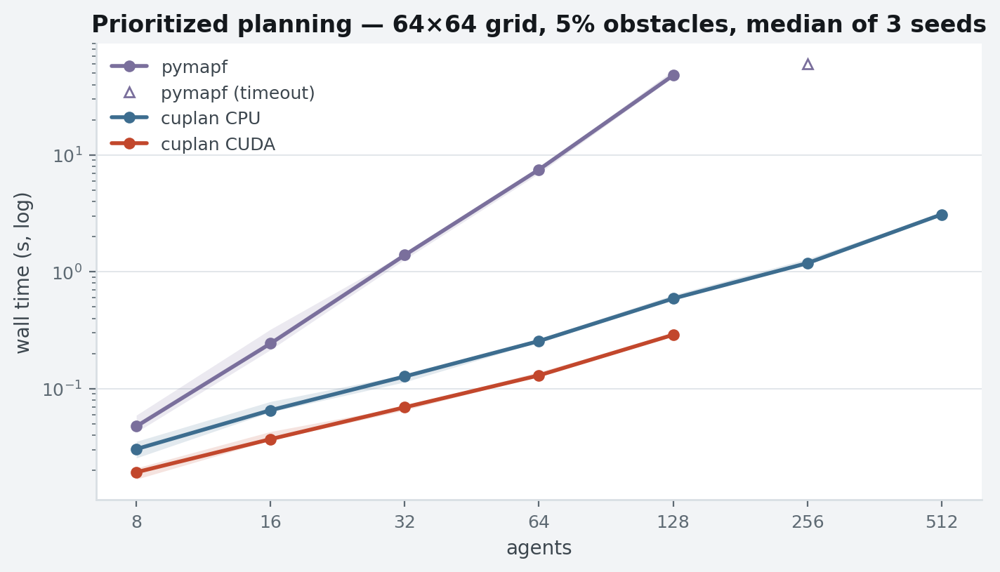

<picture>
  <source media="(prefers-color-scheme: dark)" srcset="https://raw.githubusercontent.com/openplan-labs/branding/main/assets/logo/mark-dark.svg">
  
</picture>

# cuda-planning

[](https://github.com/openplan-labs/cuda-planning/actions/workflows/ci.yml)
[](https://openplan-labs.github.io/cuda-planning/)
[](https://pypi.org/project/cuplan/)
[](LICENSE)

CUDA-accelerated multi-agent path finding (MAPF) and planning — the GPU
sibling of [pymapf](https://github.com/openplan-labs/pymapf). Every
algorithm has a vectorized NumPy reference implementation and a CUDA
implementation behind one `backend="auto" | "cpu" | "cuda"` API, with
CPU == CUDA equivalence enforced by tests. Kernels are CUDA C compiled
at runtime through CuPy's NVRTC bindings, so a machine needs an NVIDIA
driver but no CUDA toolkit — and without a GPU at all, `pip install
cuplan` still gives the full library on the reference backend.
The GPU wins by batching (one distance map per agent, one wavefront per
timestep, one thread per velocity sample), not by forcing serial
searches onto device threads; each algorithm's docs say exactly which
part runs where. Solvers included today are fast and *incomplete* —
optimal search (CBS and friends) is on the roadmap, not in the box.

## Install

```bash
pip install cuplan            # CPU reference backend (NumPy only)
pip install 'cuplan[cuda12]'  # + CUDA, for CUDA 12.x drivers
pip install 'cuplan[cuda11]'  # + CUDA, for CUDA 11.x drivers
```

The distribution and the import are both `cuplan`; only the repository
is called `cuda-planning`.
If CuPy reports missing CUDA headers on first launch, add them with
`pip install 'cupy-cuda12x[ctk]'` (pip wheels; no toolkit, no sudo).
Details in the [install guide](https://openplan-labs.github.io/cuda-planning/install/).

## Quickstart

```python
import numpy as np
from cuplan import Grid, Problem, Agent, PIBT, distance_maps

# A 64x64 grid with random obstacles; truthy = blocked.
rng = np.random.default_rng(0)
obstacles = rng.random((64, 64)) < 0.15
obstacles[0, 0] = obstacles[60, 60] = False
grid = Grid(obstacles)

# One exact distance map per agent, in a single GPU batch.
tables = distance_maps(grid, sources=[(0, 0), (60, 60)], backend="auto")

# Solve a MAPF instance; backend="auto" uses the GPU when one works.
problem = Problem(grid, [Agent("a", (0, 0), (60, 60)),
                         Agent("b", (60, 60), (0, 0))])
solution = PIBT(backend="auto").solve(problem)
print(solution.sum_of_costs, solution.makespan, solution.is_valid())
```

Paths, costs, and conflict rules match pymapf exactly, so scenarios and
results transfer between the two libraries unchanged.

## Algorithms

| Algorithm | Reference | Status |
| :-- | :-- | :-- |
| [Batched BFS distance maps](https://openplan-labs.github.io/cuda-planning/algorithms/bfs/) | frontier-parallel BFS (Merrill et al. 2012) | ✓ CPU + CUDA |
| [Batched A* shortest paths](https://openplan-labs.github.io/cuda-planning/algorithms/astar/) | Hart, Nilsson & Raphael 1968 | ✓ CPU + CUDA |
| [Space-time A* + reservations](https://openplan-labs.github.io/cuda-planning/algorithms/astar/) | Silver 2005 | ✓ CPU + CUDA |
| [Prioritized planning](https://openplan-labs.github.io/cuda-planning/algorithms/prioritized/) | Erdmann & Lozano-Pérez 1987 | ✓ CPU + CUDA |
| [PIBT](https://openplan-labs.github.io/cuda-planning/algorithms/pibt/) | Okumura et al. 2022 | ✓ CPU + CUDA |
| [Velocity obstacles](https://openplan-labs.github.io/cuda-planning/algorithms/velocity-obstacles/) | Fiorini & Shiller 1998 | ✓ CPU + CUDA |
| [Flocking (Boids)](https://openplan-labs.github.io/cuda-planning/algorithms/flocking/) | Reynolds 1987 | ✓ CPU + CUDA |
| CBS · LaCAM · LNS · SIPP · NMPC | [roadmap](https://openplan-labs.github.io/cuda-planning/roadmap/) | planned |

## Benchmarks



Measured on an NVIDIA RTX A2000 Laptop GPU (4 GB, driver 560.35.03 /
CUDA 12.6) and its host Intel Core i7-11850H; CuPy 14.2.0, NumPy
2.2.6, pymapf 0.8.0. Random grids from a fixed generator, the same
seeded instance handed to every solver, medians over seeds {0, 1, 2},
wall time for the whole `solve()` call with host/device transfers
included.

| Workload | conditions | pymapf | cuplan CPU | cuplan CUDA |
| :-- | :-- | --: | --: | --: |
| Prioritized planning | 64×64 grid, 5% obstacles, 128 agents | 47.95 s | 0.590 s | **0.289 s** |
| PIBT | 64×64 grid, 5% obstacles, 512 agents | 5.35 s | **0.541 s** | not measured¹ |
| Batched BFS | 256×256 grid, 15% obstacles, 1024 distance maps | n/a² | 62.09 s | **1.87 s** |
| Flocking (Boids) | 2048 agents, 200 steps | n/a³ | 92.16 s | **0.377 s** |

¹ The sweep's GPU died partway through the MAPF stage; those cells are
recorded as errors, not guessed at.
² pymapf has no batched distance-map primitive.
³ pymapf's simulators update agents sequentially within a timestep, so
a wall-clock comparison would time a different problem.

Three things worth knowing before you reach for the GPU:

- **Most of the win over pymapf is not CUDA.** That 47.95 s → 0.590 s
  is the *CPU* backend — a batched distance oracle and a dense
  reservation table. The device adds a further 2.0× on top.
- **The GPU pays through batch size, and the rate varies 100-fold**:
  245× for flocking at 2048 agents, 33× for 1024 distance maps on a
  256² grid, 2.0× for prioritized planning. Small work goes the other
  way — velocity obstacles at 8 agents are 0.56× on the GPU, i.e.
  *slower*. Below a few dozen agents, pass `backend="cpu"`.
- **No speedup was bought with a worse plan.** On all 105 MAPF
  instances solved by both backends, CPU and CUDA return identical
  sum of costs and makespan; against pymapf on 197 shared instances
  the median sum-of-costs ratio is exactly 1.0000.

Full study — scaling curves per grid and density, success-rate
heatmaps, solution-quality parity, CUDA phase breakdowns, and an
honest accounting of which cells the interrupted sweep did not reach:
**[Experiments](https://openplan-labs.github.io/cuda-planning/experiments/summary/)**.
Raw per-measurement CSVs are in
[`benchmarks/experiments/`](benchmarks/experiments/). Reproduce with
`python -m cuplan.benchmark.sweep` then
`python -m cuplan.benchmark.figures` (add
`pip install 'cuplan[benchmark]'` for the pymapf baselines and
charts).

## Documentation

Guides, per-algorithm semantics and parallelization notes, and the API
reference live at
**[openplan-labs.github.io/cuda-planning](https://openplan-labs.github.io/cuda-planning/)**.

## Contributing

Contributions are welcome, with or without a GPU — the CPU reference
backend carries the full test suite, and CUDA equivalence tests skip
cleanly on machines without a device. See
[CONTRIBUTING.md](CONTRIBUTING.md) for the dev setup and the
kernel/reference contract, and the
[roadmap](https://openplan-labs.github.io/cuda-planning/roadmap/) for
where help is most useful.

## License

[MIT](LICENSE) © Erwin Lejeune. Part of
[OpenPlan Labs](https://github.com/openplan-labs).
