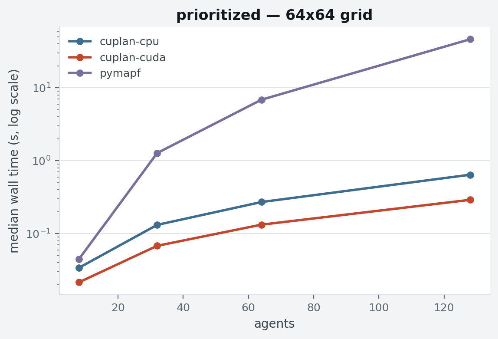
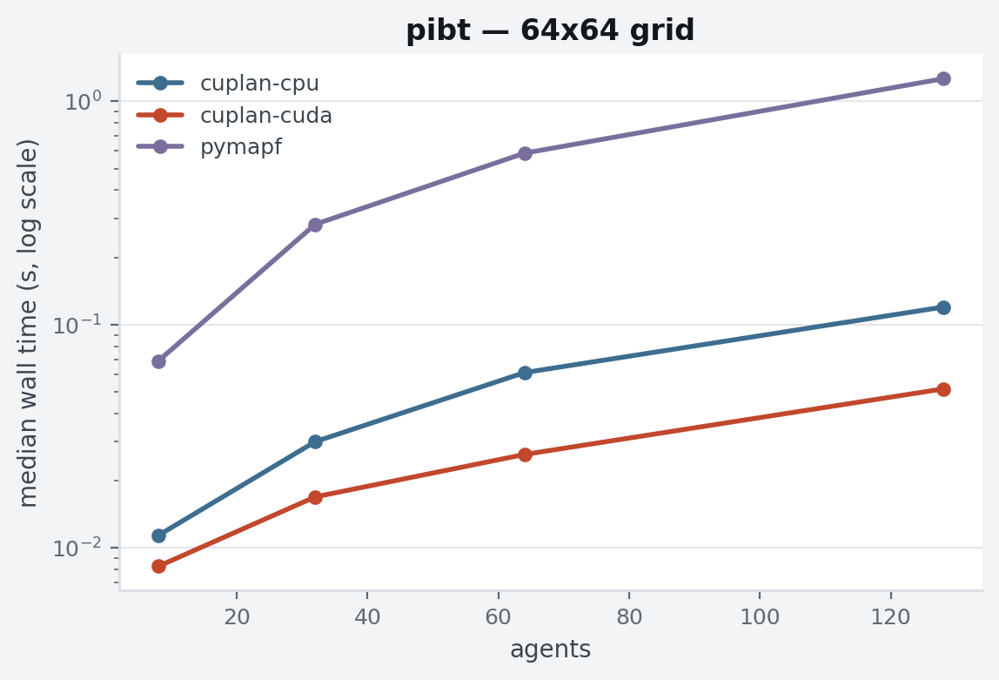
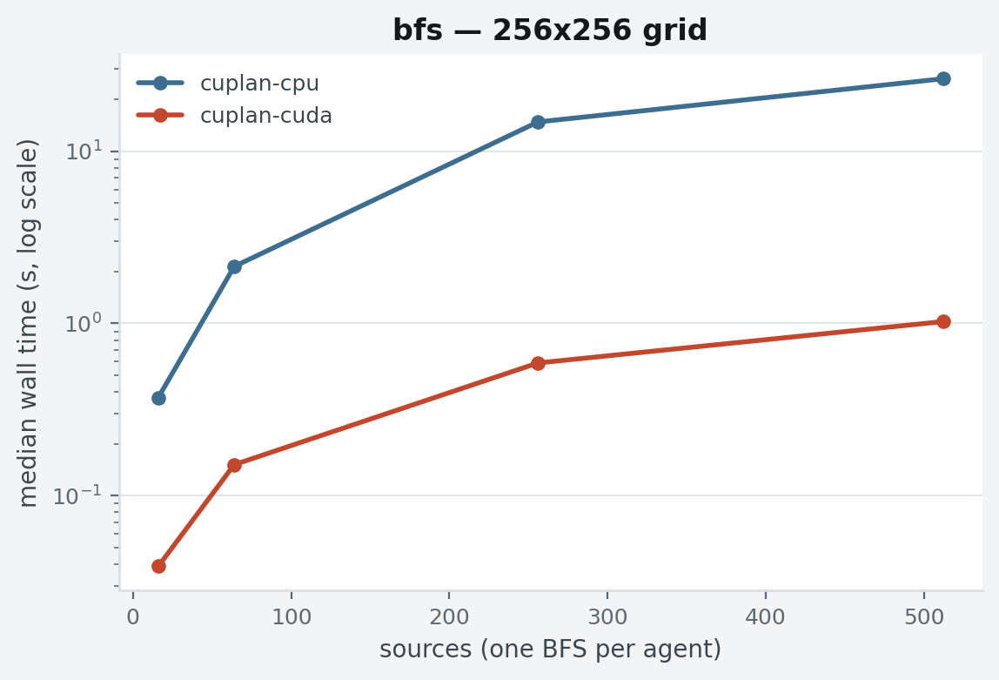
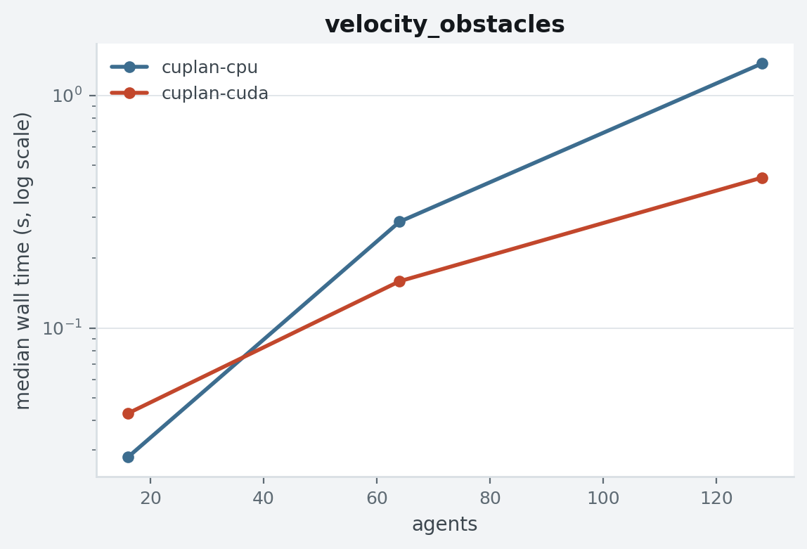

# Benchmarks

Every number on this page was measured, and comes with its conditions.

**Machine** — NVIDIA RTX A2000 Laptop GPU (4 GB, driver 560.35.03,
CUDA 12.6) and its host CPU (x86_64); Python 3.10, CuPy 14.2
(`cupy-cuda12x`), NumPy under the CPU backend.
**Problems** — random grids at 15% obstacle density, starts and goals
drawn from one connected component, seeds {0, 1, 2}; identical seeded
instances handed to every solver; medians over seeds.
**Timing** — wall time for the full `solve()` call, host/device
transfers included: the number a user sees.
**Reproduce** — `python -m cuplan.benchmark --out results` (primary
matrix), plus
`--sizes 128 --agents 32 64 128 256 --no-pymapf --bfs-sizes 256 --bfs-batches 1024 --vo-agents 256 512`
for the large-scale extension. Raw CSV, aggregated tables and charts
are committed under
[`benchmarks/results/`](https://github.com/openplan-labs/cuda-planning/tree/main/benchmarks/results).

Costs are a correctness check as much as a speed one: cuplan's CPU and
CUDA backends return *identical* solutions (the backends move the same
algorithm, not a different one), and pymapf's costs on the same
instances differ only by tie-breaking.

## Prioritized planning

| grid | agents | pymapf | cuplan CPU | cuplan CUDA |
| :-- | --: | --: | --: | --: |
| 32×32 | 32 | 0.298 s | 0.064 s | 0.045 s |
| 32×32 | 128 | 15.75 s | 0.249 s | 0.175 s |
| 64×64 | 64 | 6.870 s | 0.272 s | 0.133 s |
| 64×64 | 128 | 46.34 s | 0.643 s | **0.291 s** |

Two things are being measured at once: the wavefront formulation
(dense reservation lookups instead of set membership — most of the
CPU-vs-pymapf gap) and the GPU itself (the remaining ~2× on top). All
three solvers fail the same 32×32 / 128-agent seed — prioritized
planning is incomplete, and cramming 128 agents into 870 free cells is
where it shows.

## PIBT

| grid | agents | pymapf | cuplan CPU | cuplan CUDA |
| :-- | --: | --: | --: | --: |
| 32×32 | 64 | 0.154 s | 0.020 s | 0.014 s |
| 64×64 | 64 | 0.586 s | 0.061 s | 0.026 s |
| 64×64 | 128 | 1.263 s | 0.120 s | **0.052 s** |

The GPU accelerates the distance oracle (one batched BFS instead of a
Dijkstra per agent) and the per-step candidate ranking; the
inheritance chains run on the host in both backends, so the gap
narrows as chains dominate — visible in dense 32×32 instances.

## Batched BFS distance maps

| grid | maps | cuplan CPU | cuplan CUDA | speedup |
| :-- | --: | --: | --: | --: |
| 64×64 | 512 | 0.333 s | 0.023 s | 14× |
| 128×128 | 512 | 2.988 s | 0.157 s | 19× |
| 256×256 | 256 | 14.80 s | 0.589 s | 25× |
| 256×256 | 512 | 26.37 s | **1.025 s** | 26× |

The primitive underneath everything else, measured alone. Kernel
launches scale with graph diameter, not batch size, so the speedup
grows with both grid and batch. pymapf has no batched equivalent; its
per-goal Dijkstra cost is inside the solver timings above.

## Velocity obstacles

| agents | cuplan CPU | cuplan CUDA |
| --: | --: | --: |
| 16 | **0.028 s** | 0.043 s |
| 64 | 0.286 s | 0.159 s |
| 128 | 1.371 s | **0.443 s** |

80 timesteps, agents on a circle with antipodal goals. **The CPU wins
at 16 agents** — kernel-launch overhead dominates an
(agents × samples) grid that small — and the crossover sits between 16
and 64 agents. pymapf is absent from this family on purpose: its
simulator updates agents sequentially within a timestep (earlier
agents do not see later ones), so a wall-clock comparison would time
two different problems; see
[the semantics note](algorithms/velocity-obstacles.md).

## Reading the numbers

- The GPU pays off through *batch size*: many agents, many queries,
  many samples. Below a few dozen agents, `backend="cpu"` is the right
  choice — `backend="auto"` exists because the crossover is
  workload-dependent, not because CUDA always wins.
- Success rates below 100% are the honest face of incomplete solvers,
  not measurement noise; the same instances fail across libraries.
- A laptop-class 4 GB GPU produced all of the above. Larger devices
  raise the ceiling (batch sizes, grid sizes), not the shape of the
  curves.
